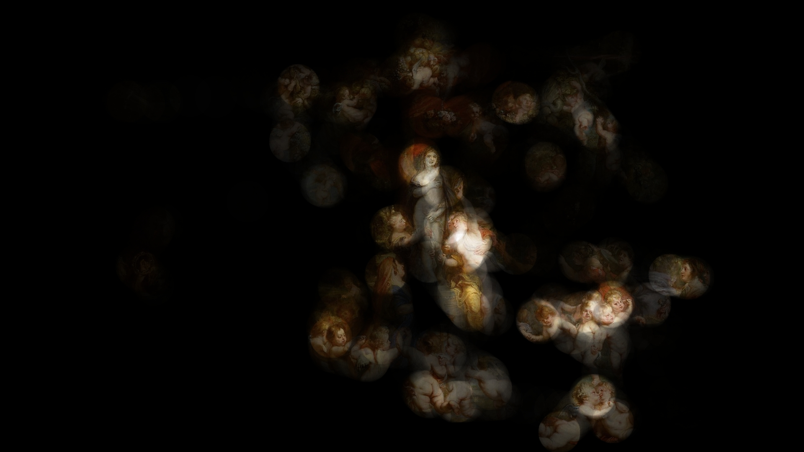

# heatgen
Heatmap-**like** image generator written in Rust. 

```
Heatmap generator 0.0.0

USAGE:
    heatgen [OPTIONS] <INPUT> <OUTPUT>

ARGS:
    <INPUT>     Input csv file path (e.g., input.csv)
    <OUTPUT>    Output heatmap image path (e.g., output.png)

FLAGS:
        --help       Prints help information
    -V, --version    Prints version information

OPTIONS:
    -h <HEIGHT>        Image height [default: 1080]
    -r <RADIUS>        Radius [default: 100]
    -w <WIDTH>         Image width [default: 1920]
```

## Example
### example.csv

### Gaze points collected by eye tracking device

